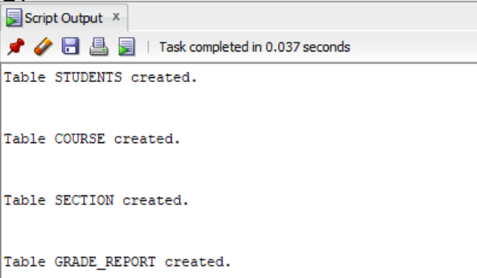

#create tables
```
CREATE TABLE students(
Name VARCHAR2(40),
student_number NUMBER,
class NUMBER,
major VARCHAR2(5)
);
CREATE TABLE course(
course_name VARCHAR2(30),
course_number VARCHAR(20),
credit_hour NUMBER,
department VARCHAR2(10)
);
CREATE TABLE section(
section_identifier NUMBER,
course_number VARCHAR2(10),
year NUMBER,
instructor VARCHAR2(10)
);
CREATE TABLE grade_report(
student_number NUMBER,
secton_identifier NUMBER,
grade VARCHAR2(5)
);
```

